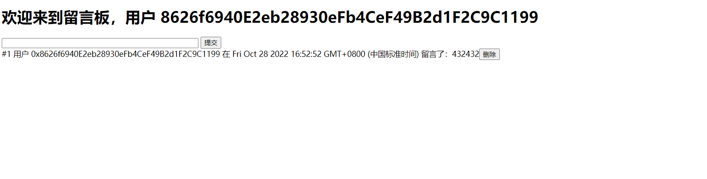

本项目展示了使用Hardhat开发留言板dApp Demo的流程，用户可以在留言板上进行留言或删除自己的留言。前端为H5 + ethers + MetaMask，开发平台为Windows10，目的是展示Hardhat对智能合约的开发、测试、部署过程。

# 开发环境搭建
项目初始化
```shell
mkdir message-board-demo
cd message-board-demo
npm init --yes
```
安装依赖
```shell
npm install hardhat chai @nomicfoundation/hardhat-toolbox -D
npm install ethers
```
添加Hardhat配置文件，在终端中运行
```shell
hardhat
```
选择`Create an empty hardhat.config.js`创建空配置文件

编辑`hardhat.config.js`，引入hardhat的工具库
```javascript
/** @type import('hardhat/config').HardhatUserConfig */  
require("@nomicfoundation/hardhat-toolbox")  // 引入hardhat常用开发插件
  
module.exports = {  
  solidity: "0.8.17",  
};
```

# 开发、编译智能合约
留言板的核心功能
1. 留言：任何人都可以往留言板上留言
2. 删除留言：任何人都可以删除自己以往的留言

项目目录下创建一个`contracts`目录，用于存放智能合约代码，然后在该目录下创建`MessageBoard.sol`

MessageBoard.sol 内容为
```solidity
// SPDX-License-Identifier: UNLICENSED
pragma solidity ^0.8.17;
import "hardhat/console.sol";
contract MessageBoard {
    struct Message {
        // 留言数据结构
        uint id;
        address author;
        string msg;
        uint timestamp;
        bool deleted;
    }
    Message[] data; // 存储留言信息
    uint ids = 0;
    uint public a = 1;
    event MessageUpdated();

    function saveMessage(string memory message) external {
        data.push(Message({id: ids++, author: msg.sender, msg: message, timestamp: block.timestamp, deleted: false}));
        emit MessageUpdated();
    }

    function deleteMessage(uint messageId) public {
        require(messageId < ids, "the message does not exist!");
        Message memory message = data[messageId];
        require(msg.sender == message.author, "you hava no right to delete it!");
        require(message.deleted == false, "the message does not exist!");
        data[messageId].deleted = true;
        emit MessageUpdated();
    }

    function getAllMessage() public view returns(Message[] memory) {
        Message[] memory ret = new Message[](getMessageCount());
        uint count = 0;
        for (uint index = 0; index < data.length; index++) {
            if (data[index].deleted == false) {
                ret[count++] = data[index];
            }
        }
        return ret;
    }

    function getMessageById(uint messageId) public view returns(Message memory) {
        require(messageId < ids, "the message does not exist!");
        require(data[messageId].deleted == false, "the message does not exist!");
        return data[messageId];
    }

    function getMessageCount() public view returns(uint) {
        uint ret = 0;
        for (uint index = 0; index < data.length; index++) {
            if (data[index].deleted == false) {
                ret++;
            }
        }
        return ret;
    }

    fallback() external payable {
        console.log("----- fallback:", msg.value);
    }

    receive() external payable {
        console.log("----- receive:", msg.value);
    }
}
```

要编译智能合约，只要在终端执行
```shell
hardhat compile
```
项目目录下会创建两个新的目录`artifacts`和`cache`，artifacts保存着合约部署以及合约交互的所有信息，而cache保存着合约的编译缓存

# 合约测试
在项目目录下创建`test`目录，用于存放智能合约的测试代码，然后在该目录下创建`MessageBoard.test.js`

MessageBoard.test.js 内容为
```javascript
const { expect } = require("chai")
const { ethers } = require("hardhat")

describe("MessageBoard contract", function() {
  it("留言", async function() {
    // 获取账户
    const [owner] = await ethers.getSigners()
    // 获取名为 MessageBoard 的智能合约
    const MessageBoard = await ethers.getContractFactory("MessageBoard")
    // 部署合约，返回 Contract 合约对象
    const contract = await MessageBoard.deploy()
    // 调用合约进行测试
    let messages = await contract.getAllMessage()
    expect(messages.length).to.equal(0)
    await contract.connect(owner).saveMessage("hello,world1")
    await contract.connect(owner).saveMessage("hello,world2")
    messages = await contract.getAllMessage()
    expect(messages.length).to.equal(2)
    expect(messages[1].msg).to.equal("hello,world2")
  });
  it("删除留言", async function () {
    const [owner, otherAccount] = await ethers.getSigners()
    const MessageBoard = await ethers.getContractFactory("MessageBoard")
    const contract = await MessageBoard.deploy()
    await contract.connect(owner).saveMessage("hello,world1")
    await contract.connect(owner).saveMessage("hello,world2")
    let messages = await contract.getAllMessage()
    await contract.connect(owner).deleteMessage(messages[0].id)
    messages = await contract.getAllMessage()
    expect(messages.length).to.equal(1)
    expect(messages[0].msg).to.equal("hello,world2")
    // 删除不是自己的留言
    await expect(contract.connect(otherAccount).deleteMessage(messages[0].id)).to.rejectedWith(Error)
    const count = (await contract.getMessageCount()).toNumber()
    expect(count).to.equal(1)
  })
})
```

在终端运行
```shell
hardhat test
```
即可开始测试

注意，测试前先编译好智能合约，如果智能合约代码有所改变，需要重新编译

# 部署合约
Hardhat内置有Hardhat Network，允许我们部署合约、 运行测试和调试代码，开发时可以部署到这个网络上。而如果测试需要与人共享，可以部署到如 Goerli、Ropsten 等测试网络上。

在项目目录下创建`scripts`，用于存放一些执行脚本，然后在该目录下创建`deploy.js`
```javascript
const { ethers } = require("hardhat");

async function main() {
  const [deployer] = await ethers.getSigners();
  console.log("Deploying contracts with the account:", deployer.address);
  console.log("Account balance:", (await deployer.getBalance()).toString());
  const Token = await ethers.getContractFactory("MessageBoard");
  const token = await Token.deploy();
  console.log("Contract address:", token.address);
}

main()
  .then(() => process.exit(0))
  .catch(error => {
    console.error(error);
    process.exit(1);
  });
```
让合约部署在Hardhat内置网络上，只需在终端运行
```shell
hardhat run scripts/deploy.js
```
智能合约就会运行在内置网络上，但运行完成后，内置网络就会停止，部署实际上会丢失，如果需要持续测试，可以单独运行Hardhat网络，只需在终端中运行
```shell
hardhat node
```
网络的默认地址是`http://localhost:8545`，然后另起一个终端，执行
```shell
hardhat run scripts/deploy.js --network localhost
```
如果需要部署到其他远程测试网络或者主网，可以查看[官方文档](https://hardhat.org/tutorial/deploying-to-a-live-network#_7-deploying-to-a-live-network)

# 前端开发
项目目录下创建`frontend`目录，用于存放前端的相关代码文件。由于本篇博客着重于hardhat部分，所以前端这边不使用任何前端框架，重点关注于前端与智能合约交互部分。

## 使用ethers + MetaMask与智能合约交互

连接到MetaMask钱包
```javascript
async connectToMetaMask() {  
  const provider = new ethers.providers.Web3Provider(window.ethereum)  
  await provider.send("eth_requestAccounts", []);  
  const signer = provider.getSigner();  
  const address = await signer.getAddress()  
  console.log("Account:", await signer.getAddress());  
  this.provider = provider  
  this.signer = signer  
  this.address = address  
}
```
连接到智能合约，需要智能合约的地址、abi以及账户
```javascript
connectToContract(contractAddress, contractAbi, account) {  
  this.contract = new ethers.Contract(contractAddress, contractAbi, account)  
  console.log(this.contract)  
}
```
当提交按钮点击时，调用智能合约保存留言
```javascript
onSubmitBtnClicked() {  
  document.querySelector('.msg-submit-btn').addEventListener('click', async (event) => {  
    const inputEl = document.querySelector('.msg-input')  
    const message = inputEl.value  
    await this.contract.connect(this.signer).saveMessage(message)  
    inputEl.value = ''  
  })  
}
```
当删除按钮点击时，调用智能合约删除留言
```javascript
onDeleteBtnClicked() {  
  document.querySelector('.message-board-container').addEventListener('click', (event) => {  
    const target = event.target  
    if (target.classList.contains('message-del-btn')) {  
      this.contract.deleteMessage(target.dataset.id)  
    }  
  })  
}
```
处理智能合约发出的事件
```javascript
onMessageBoardUpdated() {  
  this.contract.on("MessageUpdated", () => {  
    console.log('updated')  
    this.render()  
  })  
}
```


